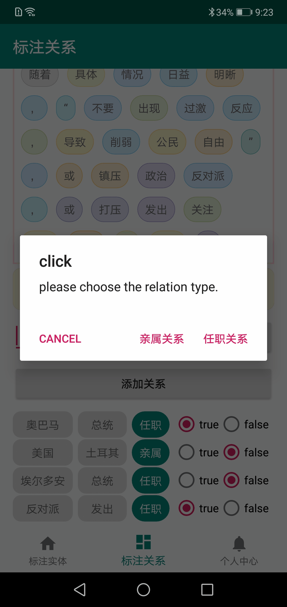
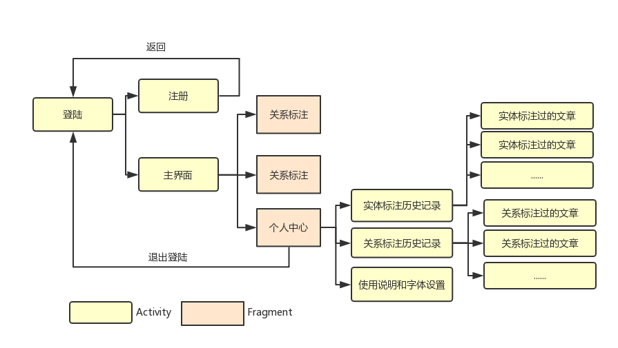

# Lable-Andriod-App
Independently completed the autumn semester homework app in "Intelligent Terminal Software Development".

## Demo

## System Description
- This system is a native APP for naming entities and their relationship annotations, and the annotation material is limited to plain text. 
- The user can obtain the article paragraph on the server for the labeling of the naming entity (the entity type is required to be the person name or official title), and upload the labeling result. 
- The user can also obtain the relationship type annotation from the article on the server, including determining whether the existing triplet is correct, marking the entity to form a new triplet (the relationship to be marked includes the relationship or kinship), and uploading the labeling result. 
- In the interactive mode, after long pressing the marked paragraph, the system has a big text explosion effect, which is convenient for the user to find the naming entities and their relationships. 
- In the interactive interface, the system presents a minimalist style, and the user can also set the font size and the horizontal and vertical screen switching.
- The Android application is based on the Android-sdk development tool, which is tested by creating an AVD (Nexus 5X API 22) in the Android Studio environment after configuring jdk.

